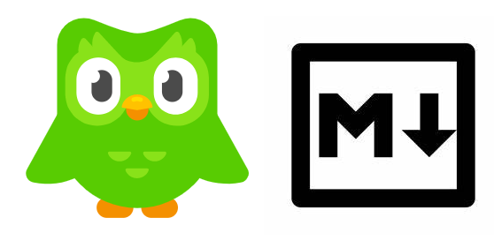

# duolingo-to-markdown



📚Update your duolingo progress to your github README profile.

## Example Output

<!-- duolingo -->
<p align="center">  Duolingo username: <strong> mac2mac </strong> </br>Last Streak:<strong> 2</strong>  </br><table align="center"><tr><th>Language</th><th>Level</th><th>Experience</th></tr> <tr><th>English </th><th><span><span >18</span></span></th><th><span><span >12654</span></span></th></tr> <tr><th>Portuguese </th><th><span><span >14</span></span></th><th><span><span >6292</span></span></th></tr></table></p> 


## SETUP
* A README.md file.
* Duolingo Account.
* Set up a GitHub Secret called  ```DUOLINGO_USERNAME``` with your Duolingo username and  ```DUOLINGO_PASSWORD``` with your Duolingo password.
* Add a ```<!-- duolingo -->``` tag in your README.md file, with three blank lines below it. The Duolingo progress will be placed here.

## Instructions
Will Update:

## TODO:
 -  Feel free to open an issue or send a pull request for anything you believe would be useful.